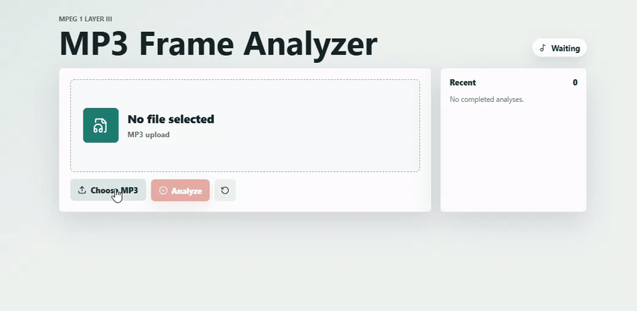

# FH - MP3 Frame Analyzer

MP3 Frame Analyzer is a TypeScript web app that uploads an MP3 file, parses its MPEG Version 1 Layer III frame data, and returns the number of audio frames found in the file.

The app has a React frontend for selecting or dragging in an MP3 file, an Express API endpoint for receiving the upload, and a custom MP3 parser that counts frames directly from the file bytes. The parser does not use an NPM package to parse MP3 frame data.



## Folder Structure

```txt
.
|-- src/
|   |-- client/                 React UI and frontend upload helpers
|   |   |-- App.tsx
|   |   |-- main.tsx
|   |   |-- styles.css
|   |   `-- uploadClient.ts
|   |-- mp3/                    Custom MP3 parsing and parser errors
|   |   |-- errors.ts
|   |   `-- mp3FrameCounter.ts
|   `-- server/                 Express API, upload handling, and HTTP errors
|       |-- app.ts
|       |-- errors.ts
|       |-- index.ts
|       `-- upload.ts
|-- tests/
|   |-- fixtures/               Sample and generated MP3 validation data
|   |-- helpers/                Synthetic MP3 byte builders for tests/tools
|   |-- integration/            API upload tests
|   `-- unit/                   Parser, server error, and frontend helper tests
|-- docs/                       Supporting documentation and README assets
|-- tools/                      Local validation and fixture-generation scripts
|-- package.json                Scripts and dependencies
`-- vite.config.ts              Vite frontend config and dev proxy
```

## Getting Started

Requirements:

- Node.js 20.19+ or a current Node.js LTS release
- npm

From a fresh clone:

```powershell
npm install
npm run dev
```

The dev command starts both processes:

- API: `http://127.0.0.1:3000`
- Web app: `http://127.0.0.1:5173`

Open the web app, choose an `.mp3` file, and select `Analyze`. A successful upload returns and displays the frame count.

## Build And Run

Build both frontend and backend:

```powershell
npm run build
```

Run the built server:

```powershell
npm start
```

When `dist/client` exists, Express also serves the built frontend assets.

## Commands

```powershell
npm run dev
```

Starts the Express API and Vite frontend together for local development.

```powershell
npm test
```

Runs Vitest unit and integration tests.

The test suite validates:

- MP3 frame counting for the included sample file.
- Synthetic MPEG Version 1 Layer III frame counting.
- ID3v2 metadata skipping.
- Leading `Xing` metadata-frame exclusion.
- Unsupported or malformed MP3 handling.
- `/file-upload` success and error responses.
- Backend error mapping for parser and upload failures.
- Frontend helper behavior for file validation and API response handling.

```powershell
npm run typecheck
```

Runs TypeScript checks for the server, client, and test/tool code. This validates that the project types line up across the Express API, React UI, MP3 parser, tests, and local tools.

```powershell
npm run lint
```

Runs ESLint. This checks TypeScript style, import consistency, unused variables, and unsafe broad typing such as `any`.

```powershell
npm run format
```

Checks formatting with Prettier.

```powershell
npm run format:write
```

Applies Prettier formatting.

## Sample Data

The repo includes validation data out of the box:

```txt
tests/fixtures/sample.mp3
tests/fixtures/generated/synthetic-003-frames.mp3
tests/fixtures/generated/synthetic-id3v2-005-frames.mp3
```

`tests/fixtures/sample.mp3` is the primary sample file. The expected public frame count for that file is:

```txt
6089
```

The generated fixtures are small deterministic MP3-like files used to verify parser behavior around frame counting and ID3v2 metadata.

Regenerate synthetic fixtures:

```powershell
npm run generate:fixtures
```

Validate the included sample file:

```powershell
npm run validate:sample
```

That command runs:

```powershell
tsx tools/validate-sample.ts tests/fixtures/sample.mp3 6089
```

It prints parser diagnostics such as file size, public frame count, physical frame count, leading metadata frames ignored, first frame offset, and ID3v2 bytes skipped.

## Backend Validation

The API integration tests dry-run backend upload behavior without starting a real network server:

```powershell
npm test -- tests/integration/fileUpload.test.ts
```

These tests validate:

- `POST /file-upload` returns `{ "frameCount": 6089 }` for the included sample.
- Missing file uploads return a JSON error.
- Wrong upload field names return a JSON error.
- Multiple files are rejected.
- Non-MP3 uploads are rejected before parsing.
- Empty `.mp3` uploads produce a safe error response.
- Invalid `.mp3` payloads produce a parser error response.
- The backend continues accepting valid uploads after a failed upload.

Manual API checks can also be run with `curl`:

```powershell
curl.exe -F "file=@tests/fixtures/sample.mp3" http://127.0.0.1:3000/file-upload
```

Expected response:

```json
{
  "frameCount": 6089
}
```

Health check:

```powershell
curl.exe http://127.0.0.1:3000/health
```

The health response includes `ok: true` and the configured upload byte limit.

## External Sample Validation

The sample MP3 was also cross-checked with MediaInfo on macOS.

Install MediaInfo:

```bash
brew install --cask mediainfo
```

Run a full scan:

```bash
mediainfo --fullscan tests/fixtures/sample.mp3
```

MediaInfo is useful as an independent inspection tool for audio metadata, stream properties, and frame-related diagnostics.

## API

### `POST /file-upload`

Accepts a multipart form upload.

Form field:

```txt
file
```

The uploaded file should be an MP3 file.

Successful response:

```json
{
  "frameCount": 6089
}
```

Error response shape:

```json
{
  "error": {
    "code": "UNSUPPORTED_MP3_FORMAT",
    "message": "No MPEG Version 1 Layer III frames were found in the uploaded file."
  }
}
```

### `GET /health`

Returns a lightweight API health response:

```json
{
  "ok": true,
  "maxUploadBytes": 26214400
}
```

## Design Decisions

I intentionally kept the stack small, manageable and feasible given the problem statement provided by FH and my personal unfamiliarity with MPEG encoding standards (which I predicted would take a good amount of time). The app needed a clear upload UI, one upload endpoint, predictable error handling, and a parser that is easy to explain. A larger framework could work, but it would add more structure than this problem needs.

### TypeScript

I used TypeScript because the riskiest part of this app is not the UI or the route, it's the binary parsing. The MP3 parser works with byte offsets, bit masks, bitrate indexes, sample-rate indexes, and custom error cases. Types make those shapes explicit:

- `Mp3FrameHeader` describes the fields decoded from a 4-byte frame header.
- `Mp3FrameCountResult` separates the public frame count from debug details like physical frames and skipped metadata.
- `Mp3FrameCounterError` keeps parser failures predictable instead of throwing random strings.

Using TypeScript was also a requirement by FH to use.

### React Frontend

I chose React because the frontend has a few small but important states: no file selected, ready, uploading, success, and error. React makes those states easy to keep in sync with the selected file, result panel, error message, and recent history.

A plain HTML page with a little JavaScript could also work here. For an even smaller version of this app, that would be a valid choice. I still chose React because Vite makes the setup quick, the component stays readable, and the UI can be polished without adding much complexity.

For a larger production app, I would consider a fuller frontend framework only if the product needed routing, auth-aware pages, server rendering, or a larger design system. This app does not need that yet and my subject matter expertise is limited in these areas.

### Express Backend

I chose Express because the backend surface area is intentionally small:

- `POST /file-upload`
- `GET /health`
- one centralized error handler

Express is enough for that. It is familiar, lightweight, and works cleanly with `supertest`, which lets the integration tests exercise the API without starting a real network server.

Based on an internal literature review, it seems alternatives like Fastify or NestJS would also be reasonable in a larger service. Fastify can be attractive for higher throughput and schema-first validation. NestJS can be useful when a backend grows into many modules, controllers, services, guards, and dependency-injected workflows. For this app, those advantages do not outweigh the extra framework structure.

### Multer Upload Handling

I used Multer for multipart form handling because parsing HTTP file uploads is not the part of the problem that needs to be custom. The important constraint is that MP3 frame data is parsed by our own code, not by an MP3 parsing package.

Multer writes uploads to temporary disk storage instead of keeping the entire upload in the Node.js heap. That is a practical scalability choice for this version: the server process is less likely to run into memory pressure when handling uploaded files.

The default upload limit is 25 MiB and can be overridden with:

```powershell
$env:MAX_UPLOAD_BYTES="52428800"
npm run dev
```

The limit is intentional as an API guardrail against unbounded request size, disk usage, and parsing time.

### Custom MP3 Parser

The parser is custom because the core requirement is to logically count MP3 frames ourselves. Using an MP3 parser package would make the hardest part easier, but it would also hide the logic this app is meant to demonstrate.

At a high level, it:

- Skips a leading ID3v2 tag by reading the ID3 header and synchsafe size field.
- Excludes a trailing 128-byte ID3v1 tag from the audio scan when present.
- Searches for MPEG frame sync bits.
- Validates MPEG Version 1 Layer III fields.
- Extracts bitrate and sample-rate indexes from the 4-byte frame header.
- Calculates each full frame length.
- Advances from one frame boundary to the next.
- Detects a leading `Xing`, `Info`, or `VBRI` metadata frame and excludes it from the public audio-frame count.

The parser focuses on MPEG Version 1 Layer III files. Other MPEG versions and layers are treated as unsupported.

That limited scope is intentional. Supporting every MPEG version and layer would make the parser larger and harder to validate. Since the expected input is MPEG Version 1 Layer III, the parser spends its complexity budget there instead of trying to become a general-purpose MP3 library.

### Testing And Validation

I used Vitest for parser and helper unit tests because it fits the TypeScript/Vite project cleanly and starts quickly. I used `supertest` for backend validation because it exercises the Express route stack directly, including Multer and the error handler.

The repo also includes synthetic MP3 fixtures. Those make edge cases repeatable without needing a collection of real audio files for every parser branch. The real sample file is still validated separately, and MediaInfo was used as an independent tool to inspect the sample outside of this codebase.

## Error Handling

Errors are normalized into JSON responses with a stable `code` and readable `message`.

Examples:

- Missing file: `400 BAD_REQUEST`
- Wrong file type: `415 UNSUPPORTED_MEDIA_TYPE`
- Empty upload: `400 BAD_REQUEST`
- Invalid MP3 structure: `422 UNSUPPORTED_MP3_FORMAT`
- Truncated MP3 data: `422 TRUNCATED_MP3_FRAME`
- Oversized upload: `413 FILE_TOO_LARGE`

The frontend displays these messages without exposing stack traces or low-level internal errors.

## Future Improvements

See [docs/IMPROVEMENTS.md](./docs/IMPROVEMENTS.md) for future scalability and performance notes.

The main future options are:

- Streaming parser support if the input model ever allowed stream-oriented processing.
- Temporary-file-backed parsing strategies for larger uploads.
- Worker-thread parsing for high concurrency.
- More formal performance benchmarks.
- Optional support for broader MPEG versions/layers.
- Additional operational metrics, timeouts, and structured logs.

## References

- [ISO/IEC 11172-3:1993](https://www.iso.org/standard/22412.html): MPEG-1 audio coding standard reference.
- [ID3v2.4.0 Main Structure](https://id3.org/id3v2.4.0-structure): ID3v2 header, footer, synchsafe integer, and tag layout reference.
- [ID3v1](https://id3.org/ID3v1): ID3v1 128-byte trailing metadata tag reference.
- [MediaInfo](https://mediaarea.net/en/MediaInfo): Independent audio inspection tool used for sample-file validation.
